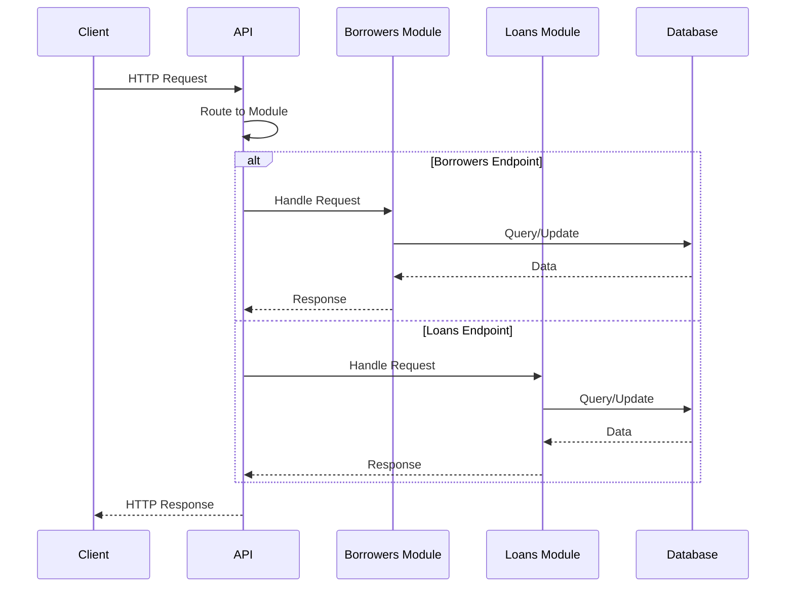

# Application Architecture

## Modular Monolith Pattern

The modular monolith is an architectural pattern that combines the simplicity of a monolithic application with the organizational benefits of a modular structure. Unlike a traditional monolith where all code exists in a single codebase without clear boundaries, a modular monolith organizes code into distinct, self-contained modules based on business domains.

### Benefits

- **Simplified Deployment**: Single deployable unit means simpler infrastructure, fewer deployment complexities, and reduced operational overhead compared to microservices
- **Better Code Organization**: Clear module boundaries prevent the "big ball of mud" problem common in traditional monoliths
- **Easier Refactoring**: Well-defined module boundaries make it easier to extract modules into separate services if needed in the future
- **Reduced Network Overhead**: In-process communication between modules is faster than network calls between microservices
- **Simpler Development**: Developers can work on the entire application without managing multiple services, databases, and deployment pipelines
- **Data Consistency**: Easier to maintain data consistency and handle transactions across modules within a single database

**Further Reading:**
- [What is a Modular Monolith - Milan Jovanović](https://www.milanjovanovic.tech/blog/what-is-a-modular-monolith)
- [Modular Monolith Architecture - ABP Framework](https://abp.io/architecture/modular-monolith)
- [Modular Monolith: A Primer - Kamil Grzybek](https://www.kamilgrzybek.com/blog/posts/modular-monolith-primer)

### Structure

A modular monolith is structured with:

- **Independent Modules**: Each module represents a business domain (e.g., Borrowers, Loans) and contains its own domain logic, data access, and presentation layers
- **Clear Boundaries**: Modules communicate through well-defined interfaces and should not directly access each other's internal implementation
- **Shared Infrastructure**: Common utilities, cross-cutting concerns, and infrastructure code can be shared across modules
- **Single Deployment**: Despite modular organization, the entire application is deployed as a single unit

## System Modules

| Module | Purpose | Key Components |
|--------|---------|----------------|
| **Borrowers Module** | Manages borrower and partner information, including their personal details and addresses | `Borrower`, `Partner`, `Address` entities; BorrowersDbContext |
| **Loans Module** | Handles loan operations, tracking loan amounts, interest rates, durations, and relationships to borrowers | `Loan` entity with `InterestRate` and `Duration`; LoansDbContext |
| **Repayments Module** | Handles operations related to payments of loans | `Payment` entity; PaymentsDbContext |
| **Shared** | Contains reusable infrastructure code and utilities used by other modules (not a dedicated business module) | `IEndpoints` interface, extension methods, common utilities |

## Communication Patterns

The application employs several communication patterns to facilitate interaction between components:

### In-Process Communication

Since this is a modular monolith, all modules run within the same process. Communication between modules happens through:

- **Direct Method Calls**: Modules can invoke services from other modules through dependency injection
- **Shared Interfaces**: Common contracts and DTOs are defined in a dedicated Contracts folder, ensuring consistent communication patterns across modules
- **Command/Query Pattern**: The application uses `ICommand`, `IQuery`, `ICommandHandler`, and `IQueryHandler` interfaces to handle operations

### Module Registration

Each module registers its services and endpoints through extension methods:

- `AddBorrowersModule(configuration)` - Registers borrower-related services and database context
- `AddLoansModule(configuration)` - Registers loan-related services and database context
- `MapEndpoints()` - Automatically discovers and maps all endpoint implementations

### Sample Request Flow

This diagram shows a typical request flow where the API routes incoming HTTP requests to the appropriate module, which then interacts with the database and returns a response.

## Technology Stack & Frameworks

### Minimal APIs

Minimal APIs is a simplified approach for building HTTP APIs with ASP.NET Core, introduced in .NET 6 and enhanced in later versions. It reduces boilerplate code and allows you to create APIs with minimal dependencies.

**How we use it**: Our endpoints are defined using Minimal APIs through implementations of the `IEndpoints` interface. Each module registers its endpoints which are automatically discovered and mapped during application startup.

**Learn more**: [Minimal APIs overview | Microsoft Learn](https://learn.microsoft.com/en-us/aspnet/core/fundamentals/minimal-apis)

### OpenAPI

OpenAPI (formerly Swagger) is a specification for describing RESTful APIs. It provides a standard way to document API endpoints, request/response formats, and data models.

**How we use it**: The application automatically generates OpenAPI specifications for all endpoints using `AddOpenApi()`. The specification describes all available routes, parameters, and response types.

**Learn more**: [OpenAPI specification | OpenAPI Initiative](https://www.openapis.org/)

### Scalar

Scalar is a modern, beautiful API documentation tool that provides interactive API documentation based on OpenAPI specifications.

**How we use it**: In development mode, Scalar serves the API documentation at `/scalar/v1`, providing an interactive interface to explore and test API endpoints.

**Learn more**: [Scalar API Reference](https://github.com/scalar/scalar)

### Entity Framework Core

Entity Framework Core (EF Core) is a modern object-relational mapper (ORM) for .NET. It enables developers to work with databases using .NET objects and eliminates the need for most data-access code.

**How we use it**: Each module has its own `DbContext` (BorrowersDbContext, LoansDbContext) to manage database operations. We use EF Core migrations to manage database schema changes, and automatic migration application at startup ensures the database is always up-to-date.

**Learn more**: [Entity Framework Core | Microsoft Learn](https://learn.microsoft.com/en-us/ef/core/)

### PostgreSQL

PostgreSQL is a powerful, open-source object-relational database system with a strong reputation for reliability, feature robustness, and performance.

**How we use it**: PostgreSQL serves as our primary database. Each module maintains its own database context, but they all connect to the same PostgreSQL instance. We use the Npgsql.EntityFrameworkCore.PostgreSQL provider to enable EF Core to work with PostgreSQL.

**Learn more**: [PostgreSQL: The World's Most Advanced Open Source Relational Database](https://www.postgresql.org/)